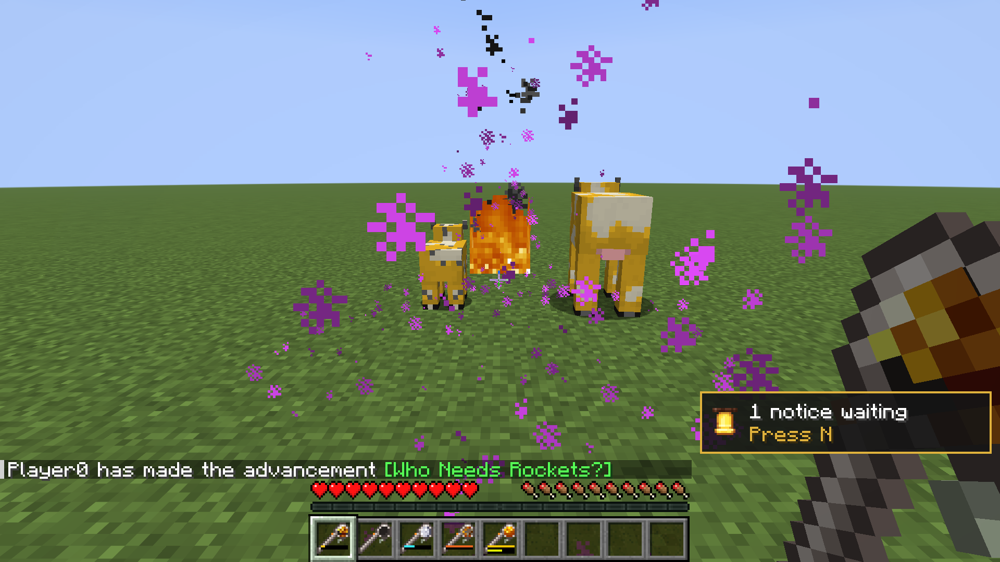

# Pale Staff

A staff of pale oak, found where the creaking lives. Craft it with what brews a potion, sugar or blaze powder or a ghast tear, and it carries that potion's effect; point it and use it, and whatever it points at gets it. A fire charge makes it burn, a golden dandelion makes it bloom, and a wind charge, an echo shard, a heart of the sea or an ender pearl each make it something else again.

## Screenshots

## Finding one

- **The creaking.** One in twenty creakings drops a staff when a player kills it, and for a creaking bound to a heart, breaking the heart is the kill. Looting on what breaks the heart adds two in a hundred per level.
- **Pale oak leaves.** One in 2500, from leaves that come down inside a pale garden, broken or decayed. Pale oak grown anywhere else never drops one.

There is no recipe for the staff itself.

## Imbuing

Craft the staff with one or more of the same ingredient, anywhere in the grid. Each fills 4 casts.

| Ingredient | A cast |
|---|---|
| Anything that brews a potion from an awkward potion (sugar, blaze powder, ghast tear, magma cream, golden carrot, rabbit's foot, glistering melon, spider eye, pufferfish, phantom membrane, turtle shell, breeze rod, slime block, cobweb, stone), or fermented spider eye | Gives that potion's effect, for a quarter of the potion's duration |
| Shulker shell | Levitation, 10 seconds |
| Glow ink sac | Glowing, 30 seconds |
| Fire charge | **Flame**: sets what it strikes alight, and where it lands catches as a fire charge would, lighting a campfire or a candle |
| Golden dandelion | **Bloom**: see below |
| Wind charge | **Gust**: a wind charge's burst where it strikes, knocking back without hurting and flipping levers and doors without breaking anything |
| Echo shard | **Sonic Boom**: the warden's attack, 10 damage straight through armor and shields, and the bolt passes through walls to reach it |
| Heart of the sea | **Storm**: lightning where it strikes, any weather, with everything lightning does: pigs to zombified piglins, villagers to witches, creepers charged, fires lit |
| Ender pearl | **Blink**: you go where the bolt ends, landing short of a wall as a pearl does, or trade places with the creature it hits. It costs a pearl's 5 damage and the same 1-in-20 endermite |

What brews what is read from the game's brewing recipes, so a datapack's or another mod's brews imbue the staff too. Potions, foods and flowers do not.

More of what it already carries tops it up. Something else replaces it, and the old charge is lost. A full staff refuses more of the same.

The socket on the staff's head shows what it carries: the sugar, the blaze powder, the fire charge. An ingredient with no flat sprite, a block or one from another mod, is set as a plain gem in its colour.

### Bloom

Everything a golden dandelion bolt makes is a baby, and kept one, the way a golden dandelion keeps a baby from growing up. Use a golden dandelion on one by hand to let it grow, as with any other.

- A cow or a mooshroom it strikes becomes a **moobloom**, a buttercup-yellow cow.
- A hostile mob it strikes has a one-in-four chance (more with Potency) to become a random gentle creature from `#pale-staff-justfatlard:bloom_creatures`. Bosses and wardens, in `#pale-staff-justfatlard:bloom_immune`, never do.
- Where it meets the ground, flowers from `#pale-staff-justfatlard:bloom_flowers` come up on anything a flower grows on, in a small circle.

Mooblooms never spawn on their own; the moobloom is a cow variant this mod adds, so it breeds, milks and leads like any cow.

## Casting

- **Use** fires a bolt down your line of sight, up to 24 blocks. The first living thing it strikes gets what the staff carries.
- **Sneak and use** gives it to you. A Bloom staff flowers the ground at your feet, and a Gust staff bursts there, a wind-charge jump with the fall forgiven as a wind charge's is. Flame, Sonic Boom, Storm and Blink will not be cast on yourself, and cost nothing for trying.

Each cast spends one charge and one durability, with a second's wait before the next. The bar above the durability bar shows the charge left, in the imbuement's colour. The tooltip lists what a cast gives, with the durations it actually gives.

The staff is also a blunt weapon, a stone sword's blow at an axe's pace. It is repaired with resin clumps.

### Who it may touch

The staff answers to what ops have trusted its caster with on Pandorical's trust page. Flame and Storm need fire; a fire staff will not cast for someone without it. Harm lands only where the caster may do harm by hand: another player as PvP allows, both ways round, and somebody else's pet, a villager or a named creature only with that trust. A harmful effect skips them and a helpful one still lands. Flame also sets fire only where the caster could build. A Sonic Boom or Storm trap whose caster is offline goes off on monsters alone.

## Enchantments

Its own six, which only a staff takes:

| | Levels | |
|---|---|---|
| **Potency** | I-II | Each level strengthens what a cast carries by one. Flame scorches; Bloom turns hostile mobs more often; Gust bursts wider; Sonic Boom hits 2 harder; Storm calls one more bolt nearby. Glowstone, so not with Prolonging. |
| **Prolonging** | I-III | Each level makes it last half as long again; Flame burns longer, and a trap stays set longer. Redstone, so not with Potency. |
| **Splash** | I-II | The bolt bursts on what it strikes and catches everything within 3 blocks (4.5 at II), less the further out. Bloom's circle of flowers widens; Gust's one burst grows instead; Storm strikes everything caught. Not for Blink. Not with Lingering. |
| **Lingering** | I | The bolt leaves something where it lands: a lingering cloud, a spread of fire, a wider and fuller bed of flowers, or for Gust, Sonic Boom and Storm a trap, and for Blink a gate (below). Not with Splash. |
| **Reservoir** | I-III | Each level holds half as many casts again: 16, 24, 32, 40. |
| **Wellspring** | I | An imbued staff draws back one charge every 30 seconds, held or carried. Infinity's counterpart, and like it, not with Mending. |

And the vanilla ones it shares with the crossbow and the mace:

| | On the staff |
|---|---|
| **Quick Charge** | The cooldown enchantment: a quarter-second less wait between casts per level, from one second down to a quarter |
| Multishot | Three bolts in a spread, for one charge and three durability. Not for Blink: you can only be in one place |
| Piercing | The bolt carries on through one more target per level |
| Unbreaking, Mending, Curse of Vanishing | As on any tool |
| Smite, Bane of Arthropods, Fire Aspect | On the swing, at an anvil, as on a mace |

### Traps

With Lingering, a Gust, Sonic Boom or Storm bolt leaves a trap where it lands: a 2-block circle of drifting cloud, sculk sparks or electric sparks that sets after half a second and stays 30 seconds (longer with Prolonging). Anything that steps in sets it off, a gust under it, a boom into it or lightning on it, once each time it comes in. What was already standing there when it set is left alone, and so is the caster. A Sonic Boom bolt that hits nothing leaves its trap at the first wall it passed through. Traps are saved with the world and still armed when it loads.

A Blink with Lingering leaves a gate of portal mist where you arrive instead: anything that follows you through it is sent back to where you set out.

## Settings

On the Pale Staff page of Pandorical's settings, for ops, and in `config/pale-staff.json`, which is written on first run. A change on the page is saved to the file at once and takes hold at once, except the two drop chances, which take hold at the next `/reload`. A change to the file needs a server restart.

| Setting | Field | Default | |
|---|---|---|---|
| Pale oak leaves drop a staff, one in | `leafChance` | 2500 (`0.0004`) | Per leaf that comes down in a pale garden, broken or decayed |
| Creakings drop a staff, percent | `creakingChance` | 5 (`0.05`) | Per creaking killed by a player |
| | `creakingLootingBonus` | `0.02` | Added per level of Looting; file only |
| Casts per ingredient | `chargesPerIngredient` | 4 | |
| Casts a staff holds | `baseCapacity` | 16 | Before Reservoir |
| A cast's share of its potion, percent | `castShareOfPotion` | 25 (`0.25`) | Of a potion's duration, per cast of its brewing ingredient. A staff keeps the share it was imbued with |
| Bloom turns a hostile mob, percent | `bloomConversionChance` | 25 (`0.25`) | Potency adds 15 per level |

## Pandorical

Pale Staff runs on the server, and Pandorical is required: it delivers the staff, its sockets and charge bar, the moobloom's coat and the names to every client that joins. Everything else is the game's own: the tooltip's effects, the bolt's particles, the clouds and the lightning.

## Development

Installing, building, the art and the tests are in [DEVELOPMENT.md](DEVELOPMENT.md).

## License

MIT, see [LICENSE](LICENSE).
